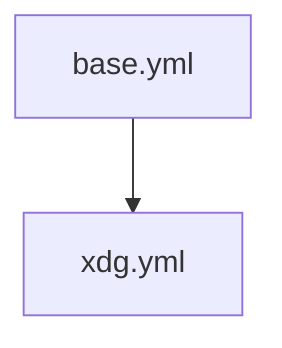

# pretext

## Setup Environment

Install ansible and go.

```sh
mkdir -vp ~/do && cd ~/do
curl https://raw.githubusercontent.com/fntyler/pretext/main/setup-env.sh | sh
```

## Usage Guide

```sh
cd ~/do/pretext

ansible-playbooks playbooks/base.yml
ansible-playbooks playbooks/xdg.yml
```


